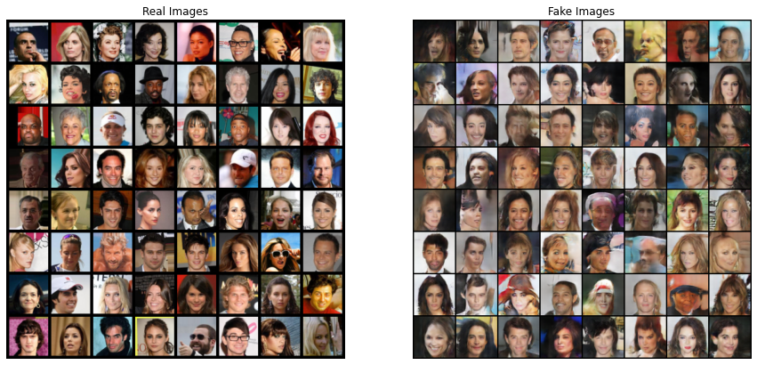

# NM_GAN_FaceGeneration
GAN-based CelebA Face Generation: Utilized GAN architecture to generate realistic celebrity face images from the CelebA dataset, showcasing benefits such as unsupervised learning and diverse data distribution handling, while acknowledging trade-offs like computational overhead and stability issues.

| Name            | Email                          | College Roll NO. | NM ID          |
| --------------- | ------------------------------ | ------------------- | -------------- |
| Fowzaan         | fowzaan.rasheed@gmail.com      | 2021503017       | 8E4AF1FB4D2CAD089814D6BED938AC27   |


# CelebA Face Generation using Generative Adversarial Networks (GANs)

This project implements a Generative Adversarial Network (GAN) to generate realistic celebrity face images using the CelebA dataset. GANs are a type of neural network architecture consisting of two networks, a Generator and a Discriminator, which are trained simultaneously to produce high-quality synthetic data that is indistinguishable from real data.

## Table of Contents

- [Introduction](#introduction)
- [Requirements](#requirements)
- [Usage](#usage)
- [Results](#results)
- [Advantages and Trade-offs](#advantages-and-trade-offs)
- [Contributing](#contributing)
- [License](#license)

## Introduction

This project aims to generate realistic celebrity face images using GANs. It follows the standard GAN architecture, where the Generator network generates synthetic images, and the Discriminator network distinguishes between real and fake images. The two networks are trained adversarially until the Generator produces images that are indistinguishable from real images.

## Requirements

- Python 3.x
- PyTorch
- torchvision
- matplotlib
- numpy

## Usage

1. Clone the repository:

   ```bash
   git clone https://github.com/your-username/celeba-face-generation.git
   ```

2. Download the CelebA dataset from [here](http://mmlab.ie.cuhk.edu.hk/projects/CelebA.html) and place it in the `./dataset` directory.

3. Install the required Python dependencies:

   ```bash
   pip install -r requirements.txt
   ```

4. Run the training script:

   ```bash
   python train.py
   ```

## Results

The trained GAN model produces high-quality celebrity face images that are visually similar to real images. The results can be found in the `./results` directory.



## Advantages and Trade-offs

### Advantages

- GANs are an unsupervised learning method, eliminating the need for manually labeled data.
- GANs generate examples from a given dataset, increasing efficiency by producing realistic results.
- Discriminator, when trained, can work as a classifier.
- GANs can learn complicated and messy data distributions, tackling diverse problems.
- GANs can be adapted to multiple formats like text, video, image, audio, etc.

### Trade-offs

- Requires significant computational overhead.
- Generated results may sometimes be distinguishable from real data.
- Generating high-quality results from text and audio is challenging.
- Training can be unstable between Generator and Discriminator.
- Lack of density estimation and intrinsic evaluation metrics.


## Contributing

Contributions are welcome! Feel free to open issues or submit pull requests for any improvements or additional features.

## License

This project is licensed under the MIT License - see the [LICENSE](./LICENSE) file for details.
